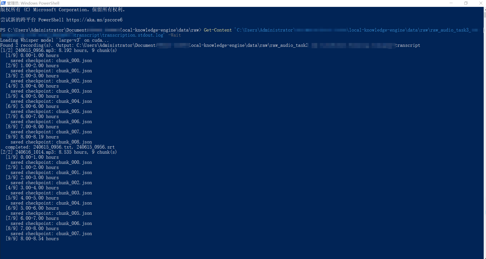

# Local Knowledge Engine

[中文](README.md) | **English**

Local Knowledge Engine (LKE) is a local-first knowledge compilation method and
lightweight toolchain for long-form courses and training materials. It is
designed to keep evidence traceable, make model output reviewable, and produce
durable knowledge assets that remain useful over time.

LKE is not a one-click AI summarizer. It combines executable local evidence
tooling with model-assisted compilation and explicit human approval:

> Tooling handles evidence. Models perform compilation. Humans approve knowledge.

## Workflow

```text
Long-form Course / Training Material
                ↓
       Local Transcription
                ↓
 Traceable Transcript / Evidence
                ↓
   Knowledge Compilation
                ↓
        Human Review
                ↓
 Durable Markdown Knowledge Asset
```

LKE is intended for long courses, technical training, lecture series, and other
long-form educational audio or video. V1 includes:

- local generation of TXT, SRT, checkpoints, and a provenance manifest;
- a resumable Whisper CLI that transcribes media in independent chunks;
- a model-independent Knowledge Compilation Contract, prompt, and template;
- an explicit human-review gate before knowledge is approved.

V1 does not include a GUI, web service, RAG system, vector database, cloud sync,
or unattended knowledge publishing. See [Architecture](docs/en/Architecture.md)
and [Limitations](docs/en/Limitations.md) for the exact boundaries.

## Installation

Python 3.11+, `ffmpeg`, and `ffprobe` are required. The PowerShell setup script
creates a project-local virtual environment. CPU is the portable default; CUDA
is an optional acceleration path.

```powershell
# CPU
.\scripts\setup_environment.ps1 -Runtime cpu

# NVIDIA CUDA 12.6 wheel
.\scripts\setup_environment.ps1 -Runtime cuda
```

Manual installation is also supported:

```powershell
python -m venv .venv
.\.venv\Scripts\python.exe -m pip install -r requirements-cpu.txt
.\.venv\Scripts\python.exe -m pip install -e .
```

The runtime files pin PyTorch to `2.13.0` to avoid publicly disclosed
checkpoint-deserialization issues in older versions. Never load models or
checkpoints from an untrusted source. See
[Third-party notices](THIRD_PARTY_NOTICES.md) for dependency, model, and FFmpeg
license boundaries.

## Usage

```powershell
.\.venv\Scripts\lke.exe check
.\.venv\Scripts\lke.exe transcribe ".\data\raw\my-course" `
  --output ".\data\output\my-course\transcript" `
  --model small `
  --device auto `
  --language en `
  --resume
```

The CLI defaults to the `small` model, selects CPU or CUDA automatically, and
saves a checkpoint for each chunk:

```text
transcript/
├── .checkpoints/
├── recording_01.txt
├── recording_01.srt
└── manifest.json
```

`manifest.json` records each source filename, SHA256, duration, model, language,
device, chunk length, Whisper version, and output filenames. See
[Provenance](docs/en/Provenance.md).

## Knowledge Compilation

Knowledge Compilation is not a local Python algorithm and is not invoked by
`lke transcribe`. Provide the transcript, SRT, manifest,
[Compilation Contract](docs/en/Knowledge_Compilation.md), standard prompt, and
output template to a model capable of following the contract across the full
course context.

Every candidate knowledge document must pass
[Human Review](docs/en/Human_Review.md). Model output is not approved knowledge.
If a cloud model is used, the supplied transcript leaves the local boundary;
confirm authorization, confidentiality requirements, retention settings, and
the provider's data policy first. See [Privacy](PRIVACY.md).

## Data and privacy boundary

The public repository contains no real course media, transcripts, knowledge
outputs, runtime logs, model weights, or unredacted screenshots. `data/`, common
media formats, subtitles, and checkpoint formats are ignored by Git by default.

Users remain responsible for source-material rights, speaker consent,
confidentiality obligations, and lawful processing of personal data. Local
execution does not make content safe to publish. Public examples must be
self-created, synthetic, Public Domain, or explicitly licensed for
redistribution.

## Project status

The current version is `0.1.0` (Alpha):

- local transcription has been exercised end to end on at least three internal
  courses, covering 19 TXT/SRT pairs and approximately 42 hours 10 minutes;
- 16 dependency-free unit tests cover the CLI, configuration, media discovery,
  checkpoints, SRT, manifests, and a mocked transcription flow;
- CI compiles the source and runs unit tests on Python 3.11 and 3.12;
- CPU and CUDA dependencies are declared separately, with CPU as the portable
  default;
- real model inference, hardware-specific performance, and long-media boundary
  quality still require validation in each target environment.



Alpha status is not a production guarantee. Whisper may misrecognize technical
terms, brands, numbers, units, and standard identifiers. Independent chunks may
also introduce missing or duplicated words at boundaries.

## Documentation

| Document | Purpose |
|---|---|
| [Architecture](docs/en/Architecture.md) | Five-layer architecture and system boundaries |
| [Workflow](docs/en/Workflow.md) | Standard end-to-end process |
| [Audio Transcription](docs/en/Audio_Transcription.md) | CLI and evidence generation |
| [Environment Setup](docs/en/Environment_Setup.md) | CPU/CUDA installation and verification |
| [Knowledge Compilation](docs/en/Knowledge_Compilation.md) | Model-independent compilation contract |
| [Provenance](docs/en/Provenance.md) | Manifest and traceability rules |
| [Human Review](docs/en/Human_Review.md) | Human approval protocol |
| [Model Guidance](docs/en/Model_Guidance.md) | Model selection and data boundaries |
| [Limitations](docs/en/Limitations.md) | Known limitations and unverified areas |
| [Release Review](docs/en/Release_Checklist.md) | Open-source release checks |

Before contributing, read [Contributing](CONTRIBUTING.md) and the
[Code of Conduct](CODE_OF_CONDUCT.md). Report security issues privately as
described in the [Security Policy](SECURITY.md).

## License

Original code and documentation in this repository are available under the
[MIT License](LICENSE). That license does not cover user inputs, generated
content, model weights, or third-party components. See
[Third-party notices](THIRD_PARTY_NOTICES.md).

> Evidence is preserved. Knowledge is compiled. Uncertainty is explicit.
> Approval is human. Outputs stay portable.
